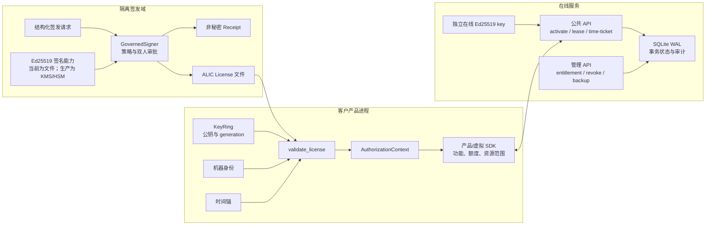
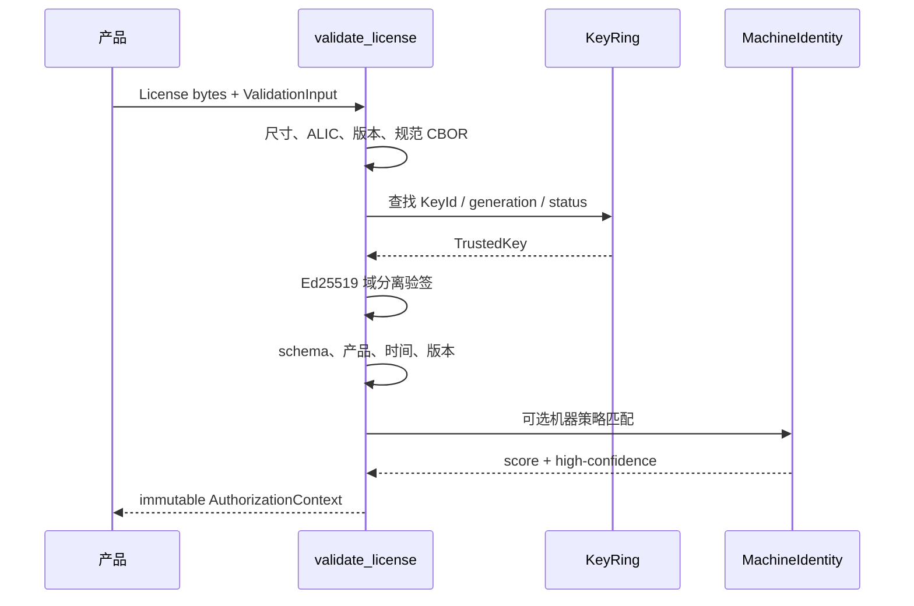
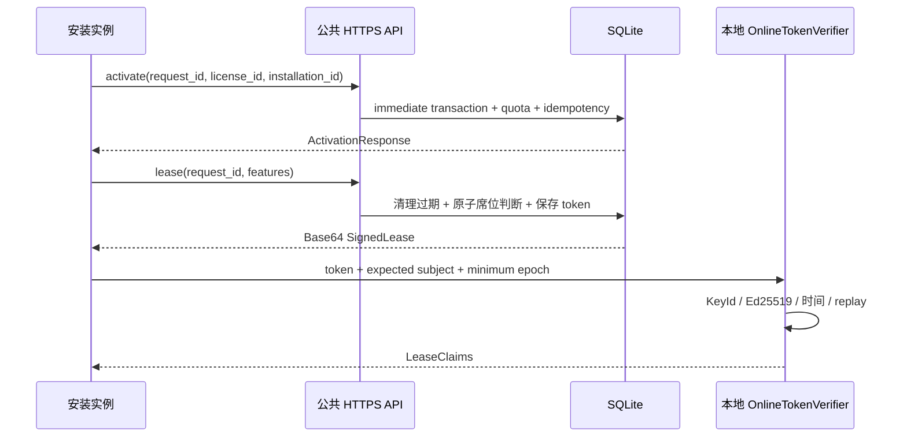
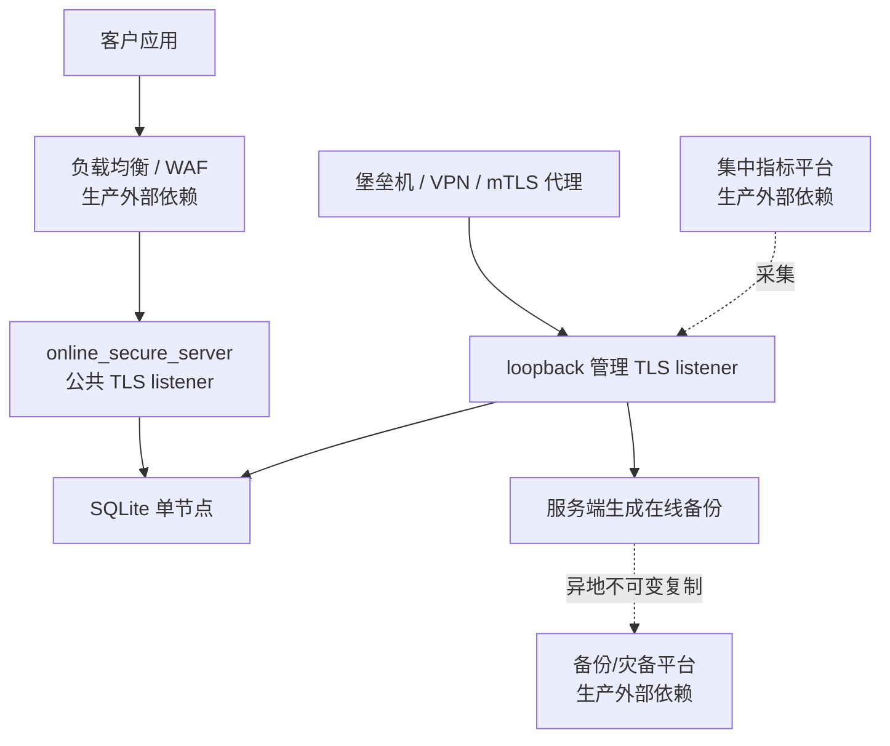

# LicenseSystem 项目架构

## 1. 系统定位

LicenseSystem 是一个 Rust 商业软件授权参考实现，提供：

- Ed25519 + 规范 CBOR 的离线 License 签发与验证；
- 不可变 `AuthorizationContext` 与产品业务深度绑定；
- Windows 机器身份、加权匹配和本地受保护时间锚；
- 在线激活、浮动 Lease、TimeTicket、撤销代际与重放保护；
- 内存参考服务和 SQLite 单节点事务服务；
- 管理认证、TLS、限流、指标、在线备份与恢复校验；
- key generation、minimum generation、高风险双人审批和签发 receipt；
- 测试向量、随机/突变测试、fuzz target 与 Python 跨语言验证。

本项目已经完成协议和单节点参考实现，但不是开箱即用的生产 License 平台。生产上线仍依赖 KMS/HSM、企业身份、代码签名、集中监控、备份平台和组织审批。

## 2. 总体组件



## 3. 模块结构

| 模块 | 路径 | 职责 |
| --- | --- | --- |
| crate 入口 | `src/lib.rs` | 导出正式模块和常用离线 API |
| 离线核心 | `src/license/` | Payload、CBOR、签发、验签、KeyRing、治理签发 |
| 机器身份 | `src/machine/` | Windows 信号采集、归一化、域分离指纹、加权匹配 |
| 时间锚 | `src/time_anchor/` | HMAC/DPAPI 状态保护、回拨检测、原子持久化 |
| 虚拟 SDK | `src/demo_sdk/` | 演示授权上下文如何进入算法、调度、模型和设备路径 |
| 在线协议 | `src/online/token.rs` | Lease/TimeTicket 规范 CBOR 与独立域签名 |
| 在线客户端 | `src/online/client.rs` | token 验签、subject、时间、epoch 和重放检查 |
| 内存服务 | `src/online/service.rs` | 单互斥锁参考状态机 |
| SQLite 服务 | `src/online/sqlite.rs` | WAL、schema、immediate 事务、持久化幂等和备份 |
| HTTP | `src/online/http.rs` | 公共业务 Router 与稳定 JSON 错误 |
| 管理面 | `src/online/admin.rs` | Bearer 认证、管理 Router、备份触发 |
| 运维防护 | `src/online/operations.rs` | 固定窗口限流与进程内指标 |
| CLI | `src/bin/` | 密钥、签发、验证、Demo、Server、备份检查 |

`src/aes.rs`、`src/ecdsa.rs`、`src/rsa.rs` 和早期算法 CLI 是历史算法演示，不属于正式 License 信任入口。

## 4. 信任边界

### 4.1 客户端可信输入

客户端只信任编译或受控配置中的：

- 离线 License Ed25519 公钥、KeyId、状态和 generation；
- 在线 Lease/TimeTicket Ed25519 公钥和 KeyId；
- 产品自身的 `product_id`、应用版本和构建日期；
- 本机采集后归一化、哈希的机器身份；
- HMAC/DPAPI 保护的本地时间锚状态。

客户端不信任：

- License 文件中的 KeyId 本身；
- 客户端上传的 entitlement 或配额；
- 未签名的本地时间、功能开关、机器匹配布尔值；
- HTTP 返回但未通过本地公钥验证的 token；
- 可写的单一 `isLicensed` 状态。

### 4.2 签发域

生产签发私钥必须位于 KMS/HSM 或隔离服务。仓库中的测试 seed、固定 Demo key 和 `keys/rsa_private.der` 均视为公开或泄漏材料。

`GovernedSigner` 已实现结构化请求、key 状态、generation、高风险双人审批和 receipt，但当前 `SigningKey` 仍可由文件注入；生产应替换为不可导出的签名适配器。

### 4.3 在线管理域

公共 Router 不包含管理端点。安全 Server 使用两个 TLS listener：

- 公共 listener：激活、租约、时间票据；
- loopback 管理 listener：entitlement、撤销、解绑、审计、指标和备份。

参考管理认证使用至少 32 字节高熵 Bearer token，进程只保留 SHA-256 hash，并常量时间比较。生产应迁移到短期 OIDC/mTLS 和权限分级。

## 5. 离线 License 协议

### 5.1 信封

- magic：`ALIC`
- format version：`1`
- algorithm：`Ed25519`
- 最大文件：64 KiB
- 签名输入：

```text
UTF8("AUGENSTERN-LICENSE-V1\0") || canonical_payload_cbor
```

信封和 Payload 都使用确定性 CBOR。解码后重新编码并逐字节比较，拒绝字段乱序、重复键、不定长集合、非最短整数编码和尾随数据。

### 5.2 验证流程



验证成功后产品只消费 `AuthorizationContext`，不继续读取原始 License 文件。

## 6. 产品集成

虚拟图像 SDK 展示四类授权消费点：

1. 算法注册：`gpu`、`deepzoom`、`batch` feature 决定可注册能力；
2. 并行调度：`max_parallel_jobs` 使用原子 RAII permit；
3. 模型范围：`resource_scope.model_ids` 在处理路径检查；
4. 设备范围与数量：`device_ids` 和 `max_devices` 同时约束连接。

真实产品应采用同样模式：在高价值业务路径查询授权上下文，而不是在启动时只设置一次可写布尔值。

## 7. 机器身份与时间

Windows 采集器尝试获取：

- SMBIOS Type 1 UUID：高可信，权重 30；
- MachineGuid：权重 20；
- 系统卷序列号：权重 15；
- CPU Identifier：权重 10；
- TPM 类型已保留，权重 50。

每个组件使用以下逻辑产生指纹：

```text
SHA256(
  "AUGENSTERN-MACHINE-V1\0" ||
  len(product_id) || product_id ||
  len(signal_kind) || signal_kind ||
  len(normalized_value) || normalized_value
)
```

策略通过条件为：

- 匹配分数达到 signed threshold；
- 至少一个高可信组件匹配；
- 重复信号类型和重复策略项不重复计分。

时间锚记录最高可信 UTC、单调时钟值、installation_id 和 LicenseId。状态：

- HMAC：跨平台测试使用，仅完整性；
- DPAPI：Windows 当前用户绑定，兼具平台保护；
- 独占 `.lock` 文件保证单进程事务；
- 临时文件 `sync_all` 后原子替换；
- 默认允许 6 小时小幅校时，不降低已记录可信 UTC。

删除全部本地状态会表现为新安装，因此高价值授权仍需要在线激活补强。

## 8. 在线协议与状态机

在线服务使用独立签名域：

- Lease：`AUGENSTERN-LEASE-V1\0`
- TimeTicket：`AUGENSTERN-TIME-TICKET-V1\0`

默认有效期：

- Lease：300 秒；
- TimeTicket：86400 秒。



同一 installation 的续租原子替换旧 lease，只占一个席位。不同 installation 在 `BEGIN IMMEDIATE` 内读取和写入配额，防止多连接超发。

## 9. SQLite schema

schema version 1：

| 表 | 关键约束 | 用途 |
| --- | --- | --- |
| `service_identity` | 单例、KeyId、公钥 32 字节 | 防止重启误配签名身份 |
| `entitlements` | license_id 主键、正数配额、epoch 非负 | 服务端授权定义 |
| `activations` | `(license_id, installation_id)` 主键 | 安装激活 |
| `leases` | lease_id 主键、installation 唯一、复合外键 | 活动浮动席位 |
| `idempotency` | `(operation, request_id)` 主键 | 重启后返回相同响应 |
| `audit_events` | 自增 sequence | 最小化管理与状态审计 |

SQLite 配置：

- `journal_mode=WAL`
- `foreign_keys=ON`
- busy timeout 5 秒
- 写操作使用 `TransactionBehavior::Immediate`
- 未知更高 `user_version` 失败关闭

## 10. 部署拓扑



当前 SQLite 适合单节点参考部署，不提供多节点共识、自动故障转移或跨区域高可用。

## 11. 关键安全不变量

- 私钥不进入客户端库、License 文件、SQLite 数据库或 receipt；
- KeyId 不能被相同标识的另一公钥替换；
- 低于 `minimum_generation` 的 key 失败关闭；
- 规范 CBOR 保证跨语言签名字节唯一；
- entitlement 只能从管理面注册，公共请求不能自报配额；
- idempotency 相同 request_id/不同内容失败关闭；
- lease 配额判断与写入处于同一事务；
- 撤销递增 epoch，不允许回绕或降低；
- replay cache 允许完全相同 token 重试，但拒绝旧 token；
- 管理 actor 来自认证凭据，不来自请求体；
- 备份目标不覆盖已有文件，并校验完整性、schema 和签名身份。

## 12. 当前限制

- 客户端在线 replay cache 尚未与 DPAPI 时间锚统一持久化；
- SQLite 仅单节点；
- 管理认证为单 Bearer token；
- 指标为进程内累计值；
- Demo 和本地 CLI 仍支持文件私钥；
- `keys/rsa_private.der` 已被 Git 跟踪，正式发布被阻断；
- 未接入 KMS/HSM、企业审批、代码签名、SBOM、集中日志和真实灾备。

后续工作见 [ROADMAP.md](ROADMAP.md)。
